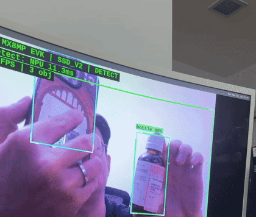

# Edge AI on Embedded Linux — i.MX 8M Plus

Full-stack embedded Linux project on the NXP i.MX 8M Plus EVK — from Yocto BSP bring-up to real-time NPU object detection with live camera feed on HDMI.

## Demo

<p align="center">
  <a href="https://github.com/Corning-AI/embedded-linux/releases/latest">
    
  </a>
</p>

Real-time object detection on the 2.3 TOPS NPU: OV5640 camera → MobileNet SSD v2 (INT8) → bounding boxes on HDMI, 11ms per inference, 9 FPS end-to-end. Full 68s video in the [latest release](https://github.com/Corning-AI/embedded-linux/releases/latest).

| | NPU | CPU | Speedup |
|---|-----|-----|---------|
| MobileNet SSD v2 (detection) | 11 ms | 45 ms | 4x |
| MoveNet Lightning (pose, 17 joints) | 13 ms | 26 ms | 2x |

```
OV5640 (MIPI-CSI2) → ISI DMA → GStreamer appsink → TFLite INT8 + VX Delegate → overlay → HDMI
  /dev/video3          zero-copy     numpy              NPU 11ms/frame          PIL      waylandsink
```

<table>
<tr>
<td width="33%" align="center">
<br>
<sub>3 objects detected simultaneously</sub>
</td>
<td width="33%" align="center">
<br>
<sub>NPU 11.3ms — stable across frames</sub>
</td>
<td width="33%" align="center">
<br>
<sub>person 84% confidence</sub>
</td>
</tr>
</table>

## What's in this repo

```
app/camera-detect/         Detection + pose estimation app (Python, GStreamer, TFLite)
kernel-modules/
├── hello/                 Minimal loadable kernel module
├── chardev/               Character device with file_operations, ioctl, mutex
└── bme280/                I2C client driver with sysfs + device tree matching
drivers/v4l2-capture/      V4L2 multi-planar mmap capture (C)
dts/                       Device tree overlay for OV5640 camera pipeline
debug/                     6 real debug cases from bring-up (with root cause)
scripts/                   Yocto build helper, serial file transfer
docs/                      Hardware guide, BSP build, WiFi/BT, camera+NPU docs
```

## Hardware

- NXP i.MX 8M Plus EVK (quad A53 + M7 + 2.3 TOPS NPU, 6 GB LPDDR4)
- OV5640 MIPI CSI-2 camera on J12
- HDMI output on J17, Weston/Wayland
- AzureWave AW-CM276NF WiFi/BT (NXP 88W8997, PCIe + UART)
- Kernel 6.6.52-lts, Yocto Scarthgap

## Quick start

```bash
# Build Yocto image (Ubuntu 22.04 host, ~2h first time)
source scripts/build-multimedia.sh

# Flash SD (Rufus DD mode), boot switches SW4: OFF OFF ON ON
# Connect: USB-C → J5 (power), micro-USB → J23 (UART, 3rd COM port, 115200)

# Run detection demo on EVK
export XDG_RUNTIME_DIR=/run/user/0 WAYLAND_DISPLAY=wayland-1
python3 /opt/camera-detect/detect_camera.py --mode demo
```

## Detection app

```bash
python3 detect_camera.py                         # Object detection
python3 detect_camera.py --mode pose              # Pose estimation
python3 detect_camera.py --mode demo              # Both simultaneously
python3 detect_camera.py --mode demo --compare    # NPU vs CPU benchmark
python3 detect_camera.py --no-display             # Headless (serial/SSH)
```

Real-time OSD overlay with FPS, latency, object count. NMS post-processing, multi-model, Wayland output.

## Kernel modules

Three out-of-tree modules, each building on the previous:

- **hello** — `module_init`/`exit`, `printk`, `__init`/`__exit` sections
- **chardev** — full char device: `file_operations`, `copy_to_user`/`copy_from_user`, mutex, automatic `/dev` node
- **bme280** — I2C client driver: device tree matching, `i2c_smbus_*`, sysfs attributes, `devm_` managed alloc

## Debug log

Issues hit during bring-up, documented with root cause:

| Issue | Root cause |
|-------|-----------|
| `/dev/video0` is not the camera | VPU encoder grabs video0; camera = `/dev/video3` |
| Camera feed has red tint | ISI outputs BGR, code assumed RGB |
| `galcore` missing from `lsmod` | Built-in to kernel, not a loadable module |
| WiFi up but no DNS | `resolv.conf` empty, DHCP client didn't write it |
| Camera stream won't start | Need media-ctl link setup before streaming |
| `weston@root` service not found | Renamed to `weston.service` in Scarthgap |

## Progress

- [x] Yocto BSP build, SD boot
- [x] Camera: OV5640 → MIPI CSI-2 → ISI → GStreamer → HDMI preview
- [x] NPU: galcore + VX Delegate + TFLite INT8 verified
- [x] Kernel modules (hello → chardev → I2C)
- [x] V4L2 capture (C) + device tree overlay
- [x] WiFi (PCIe) + Bluetooth (UART)
- [x] Real-time detection: camera → NPU 11ms → overlay → HDMI
- [ ] FreeRTOS on M7 + RPMsg

## License

MIT
