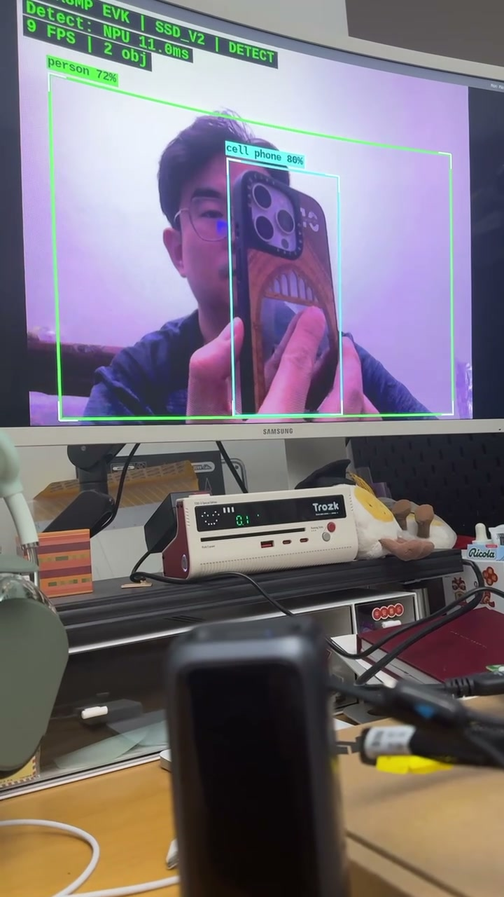
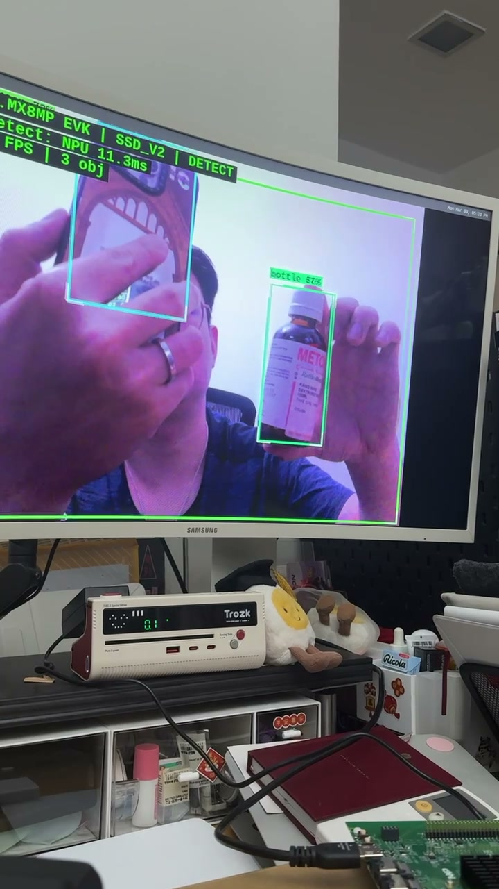
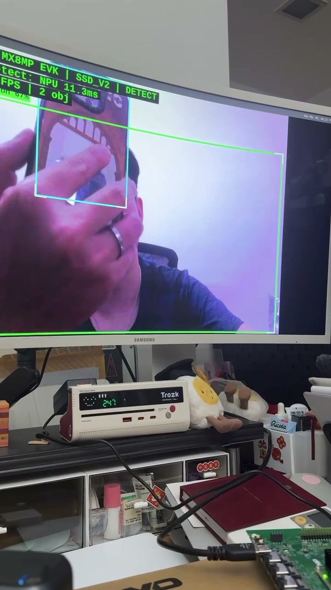
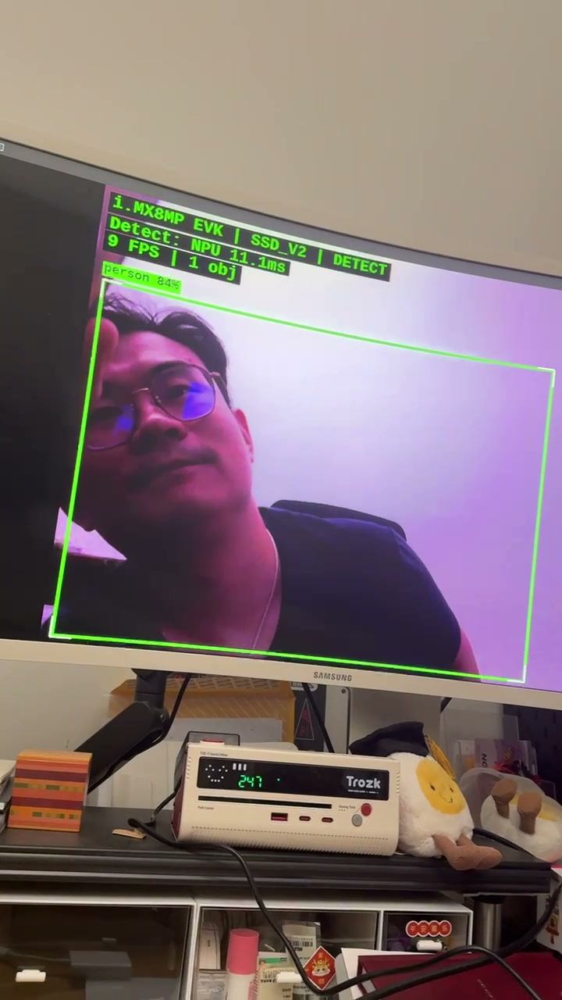

# Edge AI on Embedded Linux — i.MX 8M Plus

> **Real-time object detection at 11ms per frame** on a 2.3 TOPS NPU, with live MIPI camera feed rendered to HDMI.
> Full BSP bring-up, kernel drivers, WiFi/BT, and NPU-accelerated inference — from first boot to working demo.

---

## Live Demo — NPU-Accelerated Object Detection

<p align="center">
  <a href="https://github.com/Corning-AI/embedded-linux/releases/latest">
    
  </a>
</p>
<p align="center">
  <strong>Person (72%) + Cell Phone (80%)</strong> detected in real-time on the <strong>NPU</strong> — <a href="https://github.com/Corning-AI/embedded-linux/releases/latest">watch the full 68s demo video</a>
</p>

<table>
<tr>
<td width="33%" align="center">
<br>
<sub><strong>3 objects</strong> — person + phone + bottle</sub>
</td>
<td width="33%" align="center">
<br>
<sub><strong>NPU 11.3ms</strong> — consistent ultra-low latency</sub>
</td>
<td width="33%" align="center">
<br>
<sub><strong>person 84%</strong> — high-confidence detection</sub>
</td>
</tr>
</table>

### Key Results

| Metric | Value |
|--------|-------|
| **NPU inference latency** | **11 ms** (MobileNet SSD v2, INT8 quantized) |
| **End-to-end pipeline** | **9 FPS** (camera → NPU → overlay → HDMI) |
| **Detectable classes** | **80** (COCO: person, phone, bottle, laptop, book…) |
| **NPU vs CPU speedup** | **4× faster** (11ms vs 45ms per frame) |
| **Pose estimation** | **13 ms** (MoveNet Lightning, 17 keypoints) |

### End-to-End Pipeline

```
OV5640 ──MIPI CSI-2──▶ ISI DMA ──▶ GStreamer appsink ──▶ TFLite + NPU ──▶ PIL overlay ──▶ HDMI
 Camera     2-lane        /dev/video3    Python/numpy      VX Delegate       bounding      waylandsink
 640×480                                                    ~11ms/frame       boxes+labels
```

---

## What This Project Covers

This is a **full-stack embedded Linux + edge AI** project on the NXP i.MX 8M Plus EVK, covering every layer from silicon to application:

| Layer | What's Done | Difficulty |
|-------|-------------|------------|
| **BSP** | Yocto Scarthgap custom image build (`imx-image-multimedia`) | Medium |
| **Kernel drivers** | 3 out-of-tree modules (hello → chardev → I2C BME280) | Medium |
| **Device tree** | Annotated camera pipeline overlay (MIPI CSI-2 → ISI) | Hard |
| **V4L2 userspace** | C program with multi-planar mmap capture | Medium |
| **WiFi/BT bring-up** | DTB binary patch + PCIe/UART driver loading | Hard |
| **Camera pipeline** | GStreamer → appsink → numpy (zero-copy DMA) | Medium |
| **NPU inference** | TFLite INT8 + VX Delegate on 2.3 TOPS NPU | Hard |
| **Edge AI app** | Real-time detection + pose + OSD → HDMI display | Hard |
| **Debug methodology** | 6 documented debug cases with root cause analysis | — |

---

## Hardware

| Component | Spec |
|-----------|------|
| **SoC** | NXP i.MX 8M Plus — quad Cortex-A53 (1.8 GHz) + Cortex-M7 + **2.3 TOPS NPU** |
| **Board** | 8MPLUSLPD4-EVK (6 GB LPDDR4, 32 GB eMMC) |
| **Camera** | OV5640 MIPI CSI-2 via MINISASTOCSI adapter (J12) |
| **Display** | HDMI 2.0a (J17), Weston/Wayland compositor |
| **WiFi/BT** | AzureWave AW-CM276NF (NXP 88W8997, PCIe + UART) |
| **Kernel** | 6.6.52-lts (Yocto Scarthgap) |

## Repository Structure

```
app/camera-detect/         Real-time edge AI app (detection + pose + demo modes)
kernel-modules/
├── hello/                 Minimal loadable kernel module
├── chardev/               Character device driver (/dev node, ioctl, mutex)
└── bme280/                I2C client driver with sysfs interface
drivers/v4l2-capture/      V4L2 mmap frame capture (C, multi-planar API)
dts/                       Annotated device tree overlay (OV5640 → ISI pipeline)
debug/                     6 documented hardware/driver debug cases
scripts/                   Yocto build helper, serial file transfer tool
docs/                      Step-by-step guides: BSP, hardware, WiFi/BT, camera, NPU
```

## Quick Start

```bash
# 1. Build the Yocto image (Ubuntu 22.04 host)
source scripts/build-multimedia.sh

# 2. Flash SD card (Rufus DD mode), set SW4: OFF OFF ON ON

# 3. Connect: USB-C → J5 (power), micro-USB → J23 (debug UART, 3rd COM port, 115200)

# 4. Run the edge AI demo on the EVK
export XDG_RUNTIME_DIR=/run/user/0 WAYLAND_DISPLAY=wayland-1
python3 /opt/camera-detect/detect_camera.py --mode demo
```

## Edge AI Detection App

```bash
python3 detect_camera.py                         # Object detection (MobileNet SSD v2)
python3 detect_camera.py --mode pose              # Pose estimation (MoveNet, 17 joints)
python3 detect_camera.py --mode demo              # Both models simultaneously
python3 detect_camera.py --mode demo --compare    # NPU vs CPU side-by-side benchmark
python3 detect_camera.py --no-display             # Headless mode (SSH/serial output only)
```

Features: real-time OSD (FPS, latency, object count), NMS post-processing, multi-model support, Wayland/HDMI output, headless mode.

## Kernel Modules

Three out-of-tree modules with progressive complexity:

| Module | Concepts |
|--------|----------|
| **hello** | `module_init`/`module_exit`, `printk`, `__init`/`__exit` section markers |
| **chardev** | `file_operations`, `copy_to_user`/`copy_from_user`, mutex, dynamic major, `class_create`/`device_create` |
| **bme280** | I2C client driver, device tree `compatible` matching, `i2c_smbus_*`, sysfs attributes, `devm_` managed alloc |

## Debug Notes

Real debugging cases encountered during bring-up — each with root cause and fix:

| # | Issue | Root Cause |
|---|-------|-----------|
| 01 | `/dev/video0` is not the camera | VPU encoder registered first; ISI capture = `/dev/video3` |
| 02 | Camera feed has red tint | ISI outputs BGR, app assumed RGB |
| 03 | `galcore` not in `lsmod` | Built-in kernel driver, not a loadable module |
| 04 | WiFi connected but no DNS | `resolv.conf` not populated by DHCP client |
| 05 | Camera pipeline won't start | Media controller link setup required before streaming |
| 06 | `weston@root` service not found | Renamed to `weston.service` in newer Yocto |

## Roadmap

- [x] Yocto BSP build and first boot
- [x] Camera: OV5640 → MIPI CSI-2 → ISI → GStreamer → HDMI
- [x] NPU stack: galcore + VX Delegate + TFLite INT8
- [x] Kernel modules: hello → chardev → I2C driver
- [x] V4L2 capture (C) and device tree overlay
- [x] WiFi (PCIe) + Bluetooth (UART) bring-up
- [x] NPU benchmark: 11ms NPU vs 45ms CPU
- [x] **Real-time edge AI: camera → NPU → overlay → HDMI**
- [ ] FreeRTOS on Cortex-M7 + RPMsg inter-core communication

## License

MIT
