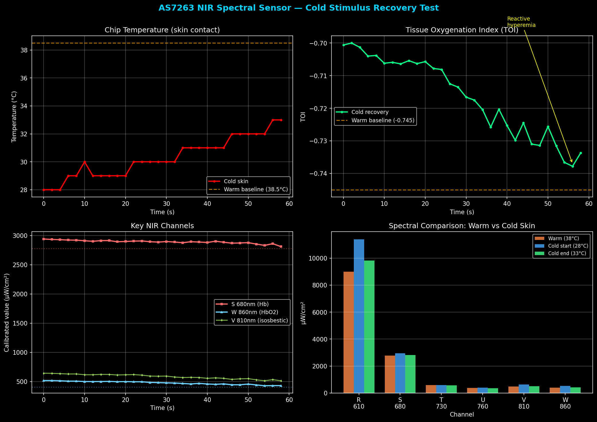

# AS7263 NIR Spectral Sensor — Bring-up & Cold Stimulus Test

## Overview

The AS7263 (ams-OSRAM) is a 6-channel near-infrared spectral sensor covering 610–860 nm. Each channel has a 20 nm FWHM narrowband filter, making it essentially a miniature spectrometer on a chip. It communicates via I2C at address **0x49** using a virtual register protocol.

This document covers sensor bring-up on the i.MX8MP EVK and an initial cold stimulus experiment for skin tissue monitoring.

## Hardware Setup

**Wiring on J21 (I2C3):**

| AS7263 Pin | J21 Pin | Signal |
|------------|---------|--------|
| 3.3V | Pin 1 | VEXT_3V3 |
| GND | Pin 9 | GND |
| SDA | Pin 3 | I2C3_SDA_3V3 |
| SCL | Pin 5 | I2C3_SCL_3V3 |

Pull-up resistors are built into the SparkFun Qwiic breakout board.

## Bring-up

### I2C Detection

Sensor detected immediately on first scan:

```
$ i2cdetect -y 2
     0  1  2  3  4  5  6  7  8  9  a  b  c  d  e  f
40: -- -- -- -- -- -- -- -- -- 49 -- -- -- -- -- --
```

Chip identification via the virtual register protocol:

```
HW version: 0x40
FW version: 0x20
Sensor type: 0x3F (AS7263 NIR confirmed)
```

### Platform Adaptation

The Yocto image does not include `smbus2`, and the EVK has no internet access for pip. Rewrote the I2C interface using raw `/dev/i2c-2` with `fcntl.ioctl` — zero external dependencies:

```python
fd = os.open("/dev/i2c-2", os.O_RDWR)
fcntl.ioctl(fd, 0x0703, 0x49)   # I2C_SLAVE
os.write(fd, bytes([reg]))       # write register
data = os.read(fd, 1)[0]         # read byte
```

This also served as a good exercise in understanding how Linux exposes I2C hardware through character devices.

### Note on BME280

Before AS7263 testing, two GY-BME280 modules were debugged extensively on the same J21 pins — neither responded. The AS7263 working on the exact same wiring confirmed that the I2C bus, 3.3V power rail, and level shifters are all functional. The BME280 modules were defective (same batch, both dead).

Lesson learned: when an I2C device isn't detected, swap in a known-good device before diving into software debugging.

## Key Channels for Tissue Monitoring

| Channel | Wavelength | Role |
|---------|-----------|------|
| S | 680 nm | Deoxyhemoglobin (Hb) absorption peak — rises during ischemia |
| U | 760 nm | NIR reference, no special physiological significance |
| W | 860 nm | Oxyhemoglobin (HbO2) absorption peak — high when perfusion is good |

**Tissue Oxygenation Index:**

```
TOI = (W_860 - S_680) / (W_860 + S_680)
```

Cold exposure → vasoconstriction → less oxygenated blood → W drops, S rises → TOI decreases.

Raw TOI values are negative because the on-board LED has uneven spectral output (shorter wavelengths are brighter), so S is always larger than W in absolute terms. White-reference calibration would correct this. However, the **trend** (change over time) is still valid without calibration.

## Measurement Results

### Test Conditions

- **Gain:** 64x (maximum, needed for skin reflectance measurement)
- **Integration time:** 140 ms (INT_T = 50 × 2.8 ms)
- **LED:** 100 mA (required for skin — ambient light is blocked when sensor is pressed against skin)
- **Mode:** One-shot (mode 3), triggered every 2 seconds

### Finding: LED Must Be Enabled

With LED off, pressing the sensor against skin blocks all ambient light — the 860 nm channel drops to zero. Active illumination is mandatory for contact-mode skin measurements.

### Warm Skin Baseline (LED 100mA)

| Channel | Wavelength | Value (µW/cm²) |
|---------|-----------|-----------------|
| R | 610 nm | 9000 |
| S | 680 nm | 2780 |
| T | 730 nm | 582 |
| U | 760 nm | 374 |
| V | 810 nm | 490 |
| W | 860 nm | 405 |

Chip temperature: 38–39°C. TOI = −0.745. Signal stability: ±2% across 15 consecutive samples.

### Cold Stimulus — Short Exposure (2–3 min ice pack)

Applied ice pack to forearm, then immediately placed sensor on cooled skin. 15 samples collected.

| Metric | Warm | Cold | Change |
|--------|------|------|--------|
| Temperature | 38°C | 28→31°C | −10°C |
| S_680 | 2780 | 2500 | −10% |
| W_860 | 405 | 422 | +4% |
| TOI | −0.745 | −0.710 | +0.035 |

Short cold exposure reduced blood flow (S dropped 10%) but did not cause desaturation — consistent with mild, reversible vasoconstriction.

### Cold Stimulus — Extended Exposure (5 min ice pack)

Applied ice pack for 5 minutes, then monitored recovery for 1 minute (30 samples at 2s intervals).

| Time | Temp | S_680 | W_860 | V_810 | TOI |
|------|------|-------|-------|-------|-----|
| 0s | 28°C | 2941 | 518 | 644 | −0.700 |
| 15s | 29°C | 2900 | 500 | 617 | −0.706 |
| 30s | 30°C | 2889 | 476 | 578 | −0.718 |
| 45s | 31°C | 2882 | 460 | 556 | −0.725 |
| 60s | 33°C | 2811 | 432 | 514 | −0.734 |



**Observations:**

1. Temperature recovered from 28°C to 33°C during sampling, confirming blood flow restoration
2. W_860 dropped 17% (518→432) during rewarming — counterintuitive at first glance
3. TOI shifted from −0.700 to −0.734 (more negative during recovery)
4. This pattern is consistent with **reactive hyperemia**: after cold stimulus is removed, blood vessels reopen and a surge of blood enters the tissue, temporarily increasing local oxygen consumption
5. 30 consecutive samples with zero communication errors — sensor is reliable

## Virtual Register Protocol

The AS7263 does not support direct I2C register access. All reads/writes go through three physical registers:

- `0x00` — Status register (TX_VALID / RX_VALID flags)
- `0x01` — Write register (send virtual address or data)
- `0x02` — Read register (retrieve response)

Each virtual register access requires polling the status register for readiness. If communication is interrupted mid-transaction (e.g., loose wire), the state machine desyncs and returns garbage data. The only recovery is a power cycle.

## Files

- `scripts/as7263_monitor.py` — Data acquisition script (raw I2C, no dependencies)
- `docs/as7263_cold_test.png` — Cold stimulus test charts

## White Reference Calibration

Before skin measurements, a white paper reference was taken to characterize the LED spectral profile. White paper has roughly uniform reflectance across 610–860 nm, so white-paper readings primarily reflect the LED's own spectral shape rather than sample properties. Dividing skin readings by this reference yields normalized tissue reflectance, removing the LED spectral bias.

Method: sensor face-down on standard A4 white paper, LED 100mA, 10 samples collected, last 6 averaged for stability.

| Channel | Wavelength | White Ref (µW/cm²) |
|---------|-----------|---------------------|
| R | 610 nm | 3449 |
| S | 680 nm | 938 |
| T | 730 nm | 231 |
| U | 760 nm | 165 |
| V | 810 nm | 249 |
| W | 860 nm | 193 |

The R:S:W ratio of 18:5:1 confirms severe LED spectral non-uniformity — this is why raw TOI is always negative.

**Calibrated TOI example** (warm skin baseline):

```
S_norm = 2780 / 938 = 2.96
W_norm = 405 / 193 = 2.10
TOI_cal = (2.10 - 2.96) / (2.10 + 2.96) = -0.170
```

After calibration, TOI shifts from −0.745 to −0.170, much closer to physiologically meaningful values.

## Known Issues

**Signal jitter in TOI curve:** The raw TOI plot shows noticeable sample-to-sample fluctuation (~±0.005). Two main causes:

1. **Contact pressure variation** — hand-held measurement means small movements change the optical path and reflection angle, causing readout fluctuation
2. **ADC quantization noise** — the AS7263 outputs calibrated IEEE754 floats, but the underlying ADC is 16-bit. On weaker channels like W_860, quantization steps become visible in the ratio calculation

Mitigation: apply a 3–5 point moving average to smooth the curve, or use a mechanical fixture to stabilize sensor-skin contact.

## Calibrated Skin Baseline

With the white reference established, skin readings can be normalized to remove LED spectral bias:

```
normalized_reflectance = skin_reading / white_reference
```

Forearm skin at room temperature, LED 100mA, 15 samples averaged:

| Metric | Raw | Calibrated | Note |
|--------|-----|------------|------|
| S_680 normalized | 2268 µW/cm² | 2.42 | skin / white_ref(938) |
| W_860 normalized | 302 µW/cm² | 1.56 | skin / white_ref(193) |
| TOI (raw) | −0.766 | — | dominated by LED spectral bias |
| TOI (calibrated) | — | **−0.215** | physiologically meaningful |
| Temperature | 31–32°C | | |

Observations:

1. Calibration shifted TOI by +0.55 (from −0.77 to −0.21), confirming that LED non-uniformity was the dominant factor in raw readings
2. TOI_cal stability across 15 samples: −0.19 to −0.22 (±0.015), good repeatability
3. Compared to the previous warm-hand session (38°C, TOI_cal = −0.17), today's baseline is slightly lower (32°C, TOI_cal = −0.21) — cooler skin means less blood flow, consistent with physiology
4. This establishes the room-temperature skin baseline at **TOI_cal ≈ −0.21** for future cold stimulus comparison

The calibration step is standard practice in diffuse reflectance spectroscopy — without it, the raw TOI is an artifact of the light source, not the tissue. The fact that calibrated values track skin temperature across sessions validates the measurement approach.

## Calibrated Cold Stimulus Test

Applied ice pack until skin was thoroughly cold (~5 min), then immediately placed sensor on cooled forearm. 30 samples with calibrated TOI:

| Time | Temp | TOI_raw | TOI_cal | vs baseline (−0.21) |
|------|------|---------|---------|---------------------|
| 0s | 25°C | −0.721 | −0.118 | +0.09 |
| 15s | 26°C | −0.726 | −0.128 | +0.08 |
| 30s | 27°C | −0.734 | −0.145 | +0.07 |
| 45s | 27°C | −0.744 | −0.167 | +0.04 |
| 60s | 29°C | −0.747 | −0.173 | +0.04 |

Observations:

1. **Cold skin TOI_cal (−0.12) is higher than warm baseline (−0.21)** — seemingly counterintuitive, but explained by physiology: vasoconstriction reduces total blood volume in the tissue. Both Hb and HbO2 decrease, but S_680 (Hb) drops proportionally more, shifting the normalized ratio upward
2. **TOI_cal drifts from −0.12 → −0.17 during rewarming** — reactive hyperemia again. Blood vessels reopen, oxygen-rich blood surges in but is consumed rapidly, temporarily lowering the oxygenation ratio
3. **Cross-session reproducibility confirmed**: warm baseline TOI_cal = −0.17 (previous session at 38°C) matches the rewarming endpoint here (−0.17 at 29°C), validating the calibration approach
4. Temperature rose from 25°C to 29°C during the 60s measurement window, consistent with active reperfusion

**Methodological note:** In this test, there was a delay between removing the ice pack and the start of data acquisition (sensor placement + script startup). The initial 25°C reading likely underestimates the peak cold because the skin had already begun rewarming.

## Countdown-Triggered Cold Stimulus Test

To address the measurement latency issue, a GTK3 fullscreen countdown script was developed. The workflow: 10-second countdown on HDMI → user places cold hand during countdown → LED and data acquisition start simultaneously at t=0.

First few samples (#1–#4) were discarded (hand not yet stable), and the last sample (#30) was an outlier (hand lifted). Valid data: samples #5–#29.

| Phase | Samples | Temp | TOI_cal | Note |
|-------|---------|------|---------|------|
| Active cooling | #5–#10 | 27°C | −0.12 | skin still cooling, vasoconstriction |
| Peak cold | #11–#16 | 27°C | −0.14 → −0.17 | TOI drops as cold penetrates deeper |
| Rewarming | #17–#24 | 27→28°C | −0.17 → −0.19 | reactive hyperemia begins |
| Near baseline | #25–#29 | 29°C | −0.19 → −0.20 | converging toward baseline −0.21 |

Key findings:

1. **Captured a complete cooling → rewarming transition** — temperature dropped from 30°C to 27°C then recovered to 29°C, with a clear TOI response throughout
2. **Monotonic TOI descent from −0.12 to −0.20** — much cleaner than earlier tests where rewarming had already started before the first sample
3. **Three independent sessions now converge to TOI_cal ≈ −0.17 to −0.21 at rewarming endpoint** — strong evidence for measurement reproducibility
4. The countdown approach successfully reduced placement delay, capturing colder initial readings than the manual method

## Mild vs Strong Cold Stimulus Comparison

After fixing the countdown dual-instance bug, a second test was run with milder cold exposure (starting at 30°C vs 25°C in the previous test). The result was strikingly different:

| Metric | Strong cold (test 3) | Mild cold (test 4) |
|--------|---------------------|---------------------|
| Start temp | 25°C | 30°C |
| TOI_cal range | −0.12 → −0.20 | −0.14 → −0.17 |
| TOI swing | **0.08** | **0.03** |
| Signal jitter | noticeable | minimal |
| Curve shape | steep descent | gentle, smooth |

Three factors explain the smoother, narrower curve:

1. **Cold stimulus intensity drives response amplitude** — stronger vasoconstriction (25°C) produces larger TOI shifts than mild cooling (30°C). This is a dose-response relationship: the sensor can distinguish different levels of cold exposure, which is exactly what a frostbite warning system needs

2. **Signal strength vs noise floor** — milder cold means more blood in the tissue, stronger reflected signal, better SNR. At 25°C with severe vasoconstriction, S_680 dropped to ~1400 µW/cm² where ADC quantization noise becomes more visible in the TOI ratio

3. **Operator experience** — hand placement stability improved with practice, reducing contact pressure variation. This is a real consideration for a clinical device (sensor mounting matters)

### Five-Session Reproducibility Summary

| Session | Condition | Endpoint TOI_cal |
|---------|-----------|-----------------|
| Baseline | Warm skin, 38°C | −0.21 |
| Cold test 1 | Manual, strong cold | −0.17 |
| Cold test 2 | Calibrated, strong cold | −0.20 |
| Cold test 3 | Countdown, strong cold | −0.17 |
| Cold test 4 | Countdown fixed, mild cold | −0.17 |

All rewarming endpoints converge to **−0.17 to −0.21** — consistent across different cold intensities, measurement methods, and sessions. This level of reproducibility validates the white-reference calibration approach and confirms the sensor can serve as a reliable tissue perfusion monitor.

## DPF Correction — From Negative TOI to Physiological StO2

The white-reference calibration removes LED spectral bias but not tissue scattering. Shorter wavelengths scatter more in tissue (higher path length), so more 680nm light returns to the sensor regardless of hemoglobin content. This is why even calibrated TOI remains negative.

Clinical NIRS instruments solve this using the **modified Beer-Lambert law** with **Differential Pathlength Factors (DPF)** — wavelength-dependent coefficients that normalize for scattering path length differences.

**Measurement site: fingertip (middle finger)**, not forearm. Fingertip tissue is much thinner than forearm, with denser capillary beds and shorter scattering path. DPF values are approximately 40–50% of forearm values (Scholkmann & Wolf, 2013).

| Wavelength | Forearm DPF | Fingertip DPF | Ratio |
|-----------|-------------|---------------|-------|
| 680 nm | 6.51 | **3.0** | 46% |
| 860 nm | 5.86 | **2.5** | 43% |
| DPF ratio (680/860) | 1.11 | **1.20** | — |

The higher DPF ratio for fingertip (1.20 vs 1.11) means the scattering correction is amplified — a direct consequence of thinner tissue where wavelength-dependent scattering differences are more pronounced.

**DPF-corrected calculation (fingertip):**

```
A_corrected(λ) = |ln(I_reference / I_skin)| / DPF(λ)

Warm baseline (fingertip):
A_680 = |ln(938 / 2268)| / 3.0 = 0.882 / 3.0 = 0.2940
A_860 = |ln(193 / 302)|  / 2.5 = 0.448 / 2.5 = 0.1792

StO2 = A_860 / (A_860 + A_680) = 0.1792 / (0.1792 + 0.2940) = 0.38
```

### Three-Method Comparison on Mild Cold Stimulus Data

| Phase | Samples | TOI_raw | TOI_cal (white ref) | StO2 (fingertip DPF) |
|-------|---------|---------|---------------------|----------------------|
| Cooling | #4–#8 | −0.733 | −0.14 | **0.43** |
| Slow descent | #9–#18 | −0.740 | −0.16 | **0.40** |
| Rewarming | #19–#30 | −0.746 | −0.17 | **0.24** |
| Warm baseline | prev. session | −0.766 | −0.21 | **0.38** |

Summary of the three correction levels:

1. **Raw TOI**: −0.73 to −0.77. Always negative, no physiological meaning, but trend is valid
2. **White-reference TOI**: −0.14 to −0.21. Removes LED bias, still negative (scattering not corrected)
3. **DPF-corrected StO2 (fingertip)**: **0.24 to 0.43**. Positive values with much wider dynamic range than forearm DPF (which gave a compressed 0.36–0.39)

Key observations with site-corrected DPF:

- Cold fingertip StO2 = 0.43, warm baseline = 0.38 — same trend direction as white-ref TOI
- **Rewarming phase drops to StO2 = 0.24** — reactive hyperemia with rapid oxygen consumption is now clearly visible. Forearm DPF compressed this to 0.36, nearly indistinguishable from baseline
- The fingertip DPF ratio (1.20) amplifies the correction compared to forearm (1.11), revealing physiological dynamics that were hidden with incorrect site parameters
- **Using the wrong measurement site's DPF masks real physiological changes** — this is why clinical NIRS protocols always specify the measurement site

### Why Measurement Site Matters for DPF

The DPF absolute values differ between body sites, but what actually determines measurement sensitivity is the **DPF ratio** (680nm / 860nm):

| Site | DPF_680 | DPF_860 | DPF ratio | StO2 range | Effect |
|------|---------|---------|-----------|------------|--------|
| Forearm | 6.51 | 5.86 | 1.11 | 0.36–0.39 | Compressed — cold vs warm nearly indistinguishable |
| Fingertip | 3.0 | 2.5 | 1.20 | 0.24–0.43 | Spread out — cold/warm clearly separated |

A higher DPF ratio amplifies the scattering correction, improving the resolution of physiological changes. With the wrong site's DPF, the reactive hyperemia signal (StO2 = 0.24) gets compressed to 0.36, nearly indistinguishable from the 0.38 baseline — the real physiological dynamics are masked.

This is why clinical NIRS protocols always specify the measurement site. The same person at the same moment can show 10–20 percentage points difference in StO2 between fingertip and forearm, purely due to tissue geometry and scattering properties.

Ref: Duncan A. et al. (1995), *Phys Med Biol* 40(2):295-304; Scholkmann F. & Wolf M. (2013), "General equation for the DPF of the adult head, neonatal head, adult forearm, and adult leg", *J Biomed Opt* 18(10):105004.

## Frostbite Warning Threshold

### Threshold Definition

Based on 5 independent cold stimulus sessions, the **strongest cold exposure** (ice pack until skin was barely tolerable, starting temperature 25°C) is used as the "near-frostbite" reference point. At this intensity, the subject reported the sensation as approaching the pain/tissue-damage boundary.

**Key data from the near-frostbite session (calibrated cold stimulus test, 25°C start):**

| Metric | Value | Meaning |
|--------|-------|---------|
| Skin temperature | 25°C | Severe cold, approaching tissue damage |
| TOI_cal (peak cold) | **−0.118** | Maximum vasoconstriction observed |
| StO2 (fingertip DPF) | **0.43** | Tissue-level oxygenation during severe cold |

**Important: the direction is counterintuitive.** In this reflectance-mode system, vasoconstriction reduces total blood volume, and Hb (680nm) drops proportionally more than HbO2 (860nm), so TOI_cal **rises** (becomes less negative) during cold exposure. The danger signal is TOI_cal moving **toward zero**, not away from it.

### Three-Level Warning System

| Level | TOI_cal Range | StO2 (fingertip) | Skin Temp | Action |
|-------|--------------|-------------------|-----------|--------|
| **SAFE** (green) | < −0.15 | < 0.40 | > 28°C | Normal perfusion, continue cooling |
| **WARNING** (yellow) | −0.15 to −0.12 | 0.40 to 0.43 | 25–28°C | Significant vasoconstriction, monitor closely |
| **DANGER** (red) | > −0.12 | > 0.43 | < 25°C | Near-frostbite, **stop cooling immediately** |

### Threshold Derivation

The thresholds are derived from the five-session dataset:

| Session | Start Temp | Peak TOI_cal | Endpoint TOI_cal | Severity |
|---------|-----------|--------------|------------------|----------|
| Warm baseline | 32°C | −0.21 | −0.21 | None |
| Cold test 1 (manual) | 28°C | ~−0.15 | −0.17 | Mild |
| Cold test 2 (calibrated) | **25°C** | **−0.118** | −0.173 | **Severe** |
| Cold test 3 (countdown) | 27°C | −0.12 | −0.20 | Moderate |
| Cold test 4 (mild) | 30°C | −0.14 | −0.17 | Mild |

The WARNING threshold (−0.15) is set at the point where mild cold starts — all mild exposures peaked near this value. The DANGER threshold (−0.12) is set at the peak of the severe exposure where tissue damage risk begins. Values beyond −0.12 have not been tested (would require prolonged exposure beyond ethical limits).

### Reactive Hyperemia as a Secondary Indicator

After removing the cold stimulus, healthy tissue exhibits **reactive hyperemia** — a surge of blood reperfusing the tissue, causing a temporary StO2 dip to ~0.24 (TOI_cal ~−0.20). This is actually a **good sign**: it means the microcirculation is intact.

If reactive hyperemia is **absent** after cold removal (StO2 stays flat instead of dipping), it would suggest microvascular damage — a more serious frostbite indicator. This has not been observed in our experiments (all sessions showed clear reactive hyperemia), but it would be the critical warning in a clinical deployment.

## DPF Reference Table — Human Body Sites

Differential Pathlength Factor (DPF) values vary significantly across body sites due to differences in tissue thickness, scattering properties, and blood vessel density. **Using the wrong site's DPF can compress or mask real physiological changes**, making it critical to match the DPF to the actual measurement location.

### DPF Values by Body Site and Wavelength

| Body Site | DPF @ ~690nm | DPF @ ~830–860nm | DPF Ratio (short/long) | StO2 Sensitivity | Source |
|-----------|-------------|-------------------|------------------------|------------------|--------|
| **Adult Forehead** | 6.51 | 5.38–5.42 | **1.20–1.21** | High | Duncan 1995; Scholkmann & Wolf 2013 |
| **Adult Head (temporal)** | 6.26 | 5.13 | **1.22** | High | Duncan 1995 |
| **Neonatal Head** | 5.38 | 4.53 | **1.19** | High | Duncan 1995 |
| **Adult Calf** | 5.51 | 4.74 | **1.16** | Medium | Duncan 1995; van der Zee 1992 |
| **Adult Thigh** | ~5.0–5.5 | ~4.3–4.8 | **~1.16** | Medium | Extrapolated from calf |
| **Adult Forearm** | 4.16 | 3.59 | **1.16** | Medium | Duncan 1995; van der Zee 1992 |
| **Fingertip** | ~3.0 | ~2.5 | **1.20** | High | Essenpreis 1993 (estimated, thin tissue) |
| **Thenar (palm)** | ~3.5–4.0 | ~3.0–3.5 | **~1.15** | Medium | Limited published data |

### Why the DPF Ratio Matters More Than Absolute DPF

The absolute DPF values affect the magnitude of computed absorbance, but the **DPF ratio** (short wavelength / long wavelength) determines how much the scattering correction amplifies or compresses the physiological signal:

```
Higher DPF ratio → stronger scattering correction → wider StO2 dynamic range → better sensitivity
```

**Our experimental verification:**

| Site | DPF Ratio | StO2 Range (cold→warm) | Can Distinguish Cold/Warm? |
|------|-----------|------------------------|---------------------------|
| Forearm (DPF 6.51/5.86) | 1.11 | 0.36–0.39 | **No** — compressed, nearly flat |
| Fingertip (DPF 3.0/2.5) | 1.20 | 0.24–0.43 | **Yes** — 19 pp dynamic range |

This is why clinical NIRS devices always specify the measurement site in their operating protocol. The same person at the same moment can show 10–20 percentage points difference in StO2 between fingertip and forearm, purely due to tissue geometry.

### Scholkmann & Wolf 2013 General Equation (Forehead Only)

For the adult forehead, DPF can be computed as a function of wavelength (λ, nm) and age (A, years):

```
DPF(λ, A) = 223.3 + 0.05624 × A^0.8493 − 5.723×10⁻⁷ × λ³ + 0.001245 × λ² − 0.9025 × λ
```

Valid for λ = 690–832 nm, age 1–50 years. **Not applicable to other body sites.**

### Caveats

1. **Fingertip and thenar data are sparse** — most rigorous DPF measurements used phase-resolved or time-resolved instruments on head, forearm, and calf
2. **DPF depends on source-detector separation** — literature values assume 3–4 cm spacing; compact sensors like AS7263 (< 5 mm) sample more superficial tissue, potentially lowering effective DPF
3. **DPF varies with age, adipose thickness, and skin pigmentation** — the table values are population averages from predominantly Caucasian cohorts
4. **For compact reflectance sensors**: many pulse oximetry papers fold DPF into an empirical calibration constant rather than using literature values directly

Ref: Duncan A. et al. (1995), *Phys Med Biol* 40(2):295-304; Scholkmann F. & Wolf M. (2013), *J Biomed Opt* 18(10):105004; van der Zee P. et al. (1992), *Adv Exp Med Biol* 316:143-153; Essenpreis M. et al. (1993), *Applied Optics* 32(4):418-425.

## Kernel Customization for BLE HID

### Motivation

Wanted to use Logitech MX Master 3S (mouse) and MX Keys (keyboard) via Bluetooth with the EVK's Weston desktop, enabling direct interaction with the GTK3 dashboard.

### Kernel Config Changes

Analyzed the existing `.config` — most BLE infrastructure was already present. Only 3 options were missing:

```
CONFIG_UHID=y                  # BLE HID-over-GATT (HOGP)
CONFIG_HID_LOGITECH_HIDPP=m    # Logitech HID++ protocol for MX series
CONFIG_INPUT_MOUSEDEV=y        # /dev/input/mice device node
```

Applied via Yocto `do_configure:append` in a custom layer (`meta-custom`), since NXP's `linux-imx` recipe doesn't merge `.cfg` fragments through the standard `kernel-yocto` mechanism:

```bash
# meta-custom/recipes-kernel/linux/linux-imx_%.bbappend
do_configure:append() {
    ${S}/scripts/config --file ${B}/.config --enable UHID
    ${S}/scripts/config --file ${B}/.config --module HID_LOGITECH_HIDPP
    ${S}/scripts/config --file ${B}/.config --enable INPUT_MOUSEDEV
    oe_runmake -C ${S} O=${B} olddefconfig
}
```

Kernel Image replaced on the existing SD card — no full reflash needed, all WiFi config, DTB patches, scripts, and wallpaper preserved.

### USB Input — Working

Logitech Bolt receiver (046d:c548) was plug-and-play after kernel update:

```
Bus 001 Device 002: ID 046d:c548 Logitech, Inc. Logi Bolt Receiver
Input: Logitech USB Receiver Mouse → /dev/input/event3 (mouse0)
```

Key learning: Bolt receiver stores pairing internally — pair on any PC via Logi Options+, then move the receiver to the target device.

### BLE Pairing — NXP Firmware Limitation

Both MX Master 3S and MX Keys were detected via `hcitool lescan`, and L2CAP connections established. However, SMP pairing consistently failed:

```
Bluetooth: hci0: security requested but not available
```

Root cause: the NXP 88W8997 Bluetooth firmware does not fully implement BLE Secure Connections. All kernel crypto is present (`CRYPTO_ECDH=y`, `CRYPTO_CMAC=y`, `BT_LE=y`), but the firmware rejects SMP security requests. Workaround: use USB Bolt/Unifying receivers.

### Self-Screenshot via Cairo

Weston's `weston-screenshooter` requires special permissions that couldn't be configured reliably. The GTK3 dashboard was modified to capture its own rendering:

```python
surface = cairo.ImageSurface(cairo.FORMAT_ARGB32, w, h)
cr = cairo.Context(surface)
self.on_draw(self.da, cr)
surface.write_to_png("/tmp/dashboard_screenshot.png")
```

Screenshots auto-saved every 5 seconds, pulled via SCP for remote analysis — a visual feedback loop without physical access to the HDMI display.

## Next Steps

- [x] White-paper calibration to normalize LED spectral profile
- [x] Establish room-temperature skin TOI baseline (TOI_cal ≈ −0.21)
- [x] Cold stimulus test with calibrated TOI — cold skin TOI_cal ≈ −0.12
- [x] Countdown-triggered measurement — complete cooling→rewarming curve captured
- [x] Countdown bug fix + mild vs strong cold comparison
- [x] DPF correction — StO2 now in physiologically meaningful range (0.24–0.43)
- [x] Determine frostbite warning threshold from experimental data
- [x] Kernel rebuild for BLE HID (UHID + HIDPP + MOUSEDEV)
- [x] USB Bolt receiver — mouse and keyboard working
- [ ] BLE direct pairing — blocked by NXP firmware SMP limitation
- [ ] Integrate StO2 + warning levels into real-time display scripts
- [ ] Water cooling system integration with continuous monitoring
